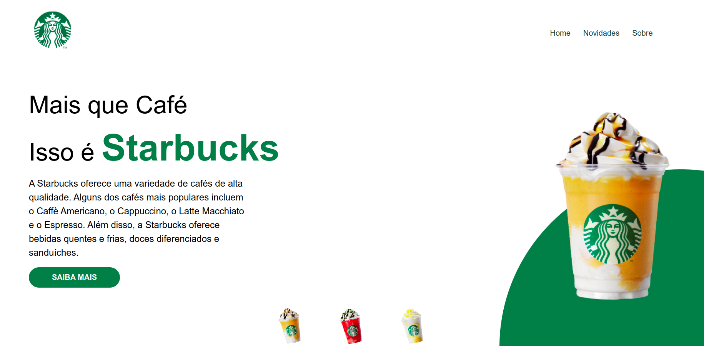

# Desafio Starbucks Vai Na Web

Este projeto foi criado para realizar o desafio proposto na Formação Front-End(Vue+React) do Vai Na Web.
O desafio consistia em reproduzir as interfaces deste **<a href="https://www.figma.com/design/lDEBqDNjbhumoZwQ7CBL7P/Starbucks?node-id=1-3&node-type=frame&t=ADLAyln3vrVS2sVP-0" target="_blank">Figma</a>**:



### Ajustes e melhorias

O projeto ainda pode melhorar muito, por isso esses são alguns ajustes e melhorias que eu pretendo implementar:

- [ ] Adicionar responsividade ao projeto
- [ ] Adicionar estilização(hover) mais elaborados nos links
- [ ] melhorar o texto das páginas

## 🚀 Começando

Essas instruções permitirão que você obtenha uma cópia do projeto em operação na sua máquina local para fins de desenvolvimento e teste.

Consulte **[Instalação](#-instalação)** para saber como implantar o projeto.

### 📋 Pré-requisitos

- **NodeJs (versão 14 ou superior)**
- **npm/yarn**

## 🔧 Instalação

### 1. Primeiro passo

Clone o reposítorio para seu ambiente local

```bash
git clone https://github.com/Le-Jr/desafio-starbucks-react.git
cd desafio-starbucks-react
```

### 2 Instale as dependências

```bash
npm install

# ou

yarn install
```

## 💡 Inicializando o servidor local

Para iniciar o servidor local basta digitar este comando

```bash
npm run dev

# ou

yarn run dev
```

## 🛠️ Construído com

Tecnologias utilizadas no projeto:

[](https://skillicons.dev)

- [ReactJs](https://react.dev/learn) - A biblioteca web utilizada
- [Styled Components](https://styled-components.com/docs) - Biblioteca usada para estilização
- [VITE](https://vite.dev/guide/) - Usado para fazer o build do projeto

## ✒️ Autor

<table>
  <tr>
    <td align="center">
      <a href"https://github.com/Le-Jr" title="Link Perfil Git Hub">
        <br>
        <sub>
          <b>Leandro Junior - Le-Jr</b>
        </sub>
      </a>
    </td>
</table>

## 🎁 Expressões de gratidão

- Agradecimentos a especialmente a instrutora <a href="https://github.com/mariaccarolina" >Carol</a> e ao facilitador <a href="https://github.com/kleber-matos">Kleber</a>
  Pelos ensinamentos que possibilitaram a existência desse projeto

---

⌨️ com ❤️ por [Leandro Junior](https://github.com/Le-Jr) 😊
